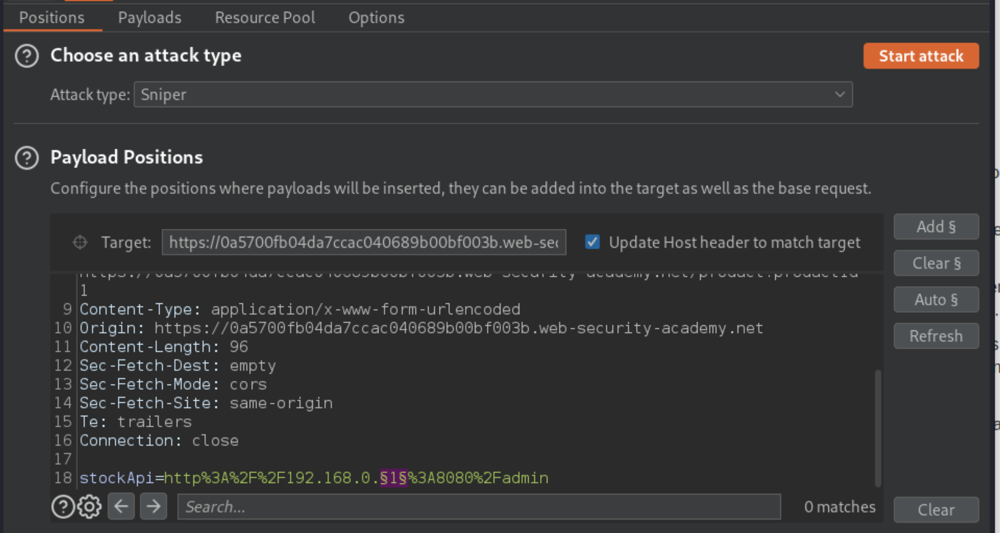
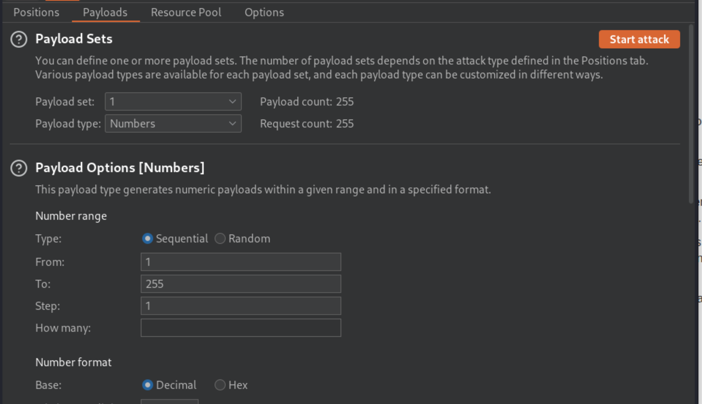
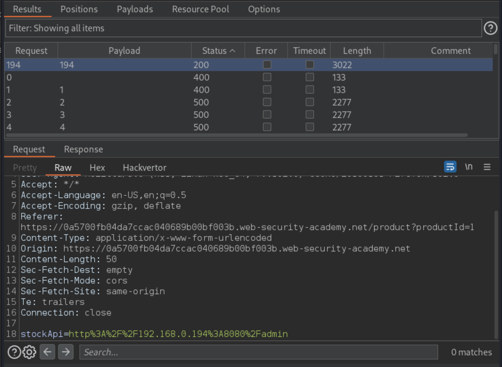
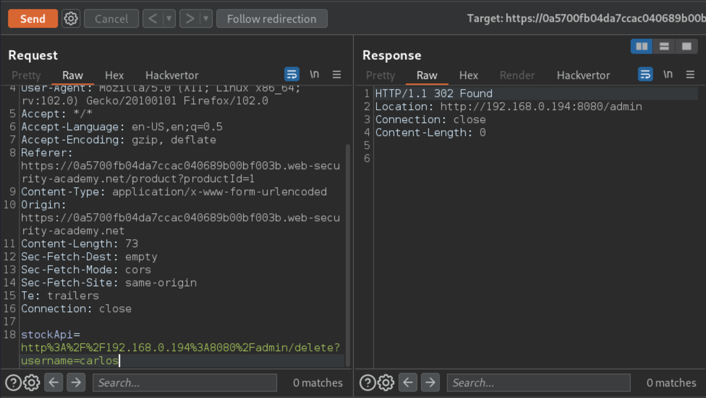

# Basic SSRF against another back-end system

## Description

[This lab](https://portswigger.net/web-security/ssrf/lab-basic-ssrf-against-backend-system) has a stock check feature which fetches data from an internal system.

## Reproduction and proof of concept

1. Visit a product, click **Check stock**, intercept the request in Burp Suite, and send it to Burp Intruder.
2. Click "Clear §", change the ``stockApi`` parameter to ``http://192.168.0.1:8080/admin`` then highlight the final octet of the IP address (the number 1), click "Add §".

3. Switch to the Payloads tab, change the payload type to Numbers, and enter 1, 255, and 1 in the "From" and "To" and "Step" boxes respectively.

4. Click **Start attack**.
5. Click on the "Status" column to sort it by status code ascending. You should see a single entry with a status of 200, showing an admin interface.

6. Click on this request, send it to Burp Repeater, and change the path in the `stockApi` to: `/admin/delete?username=carlos`

## Exploitability

An attacker will need to use the stock check functionality to scan the internal `192.168.0.X` range for an admin interface on port `8080`, then use it to delete the user `carlos`. 
