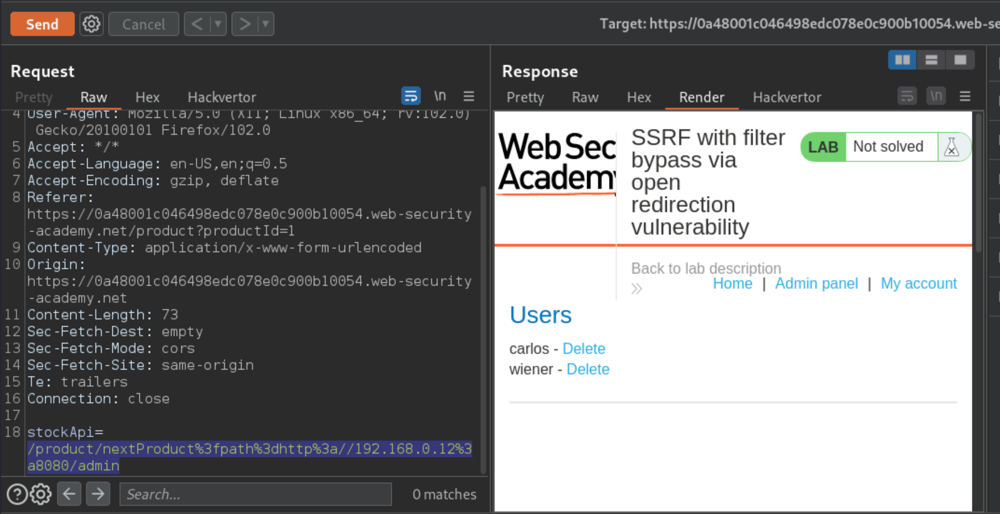
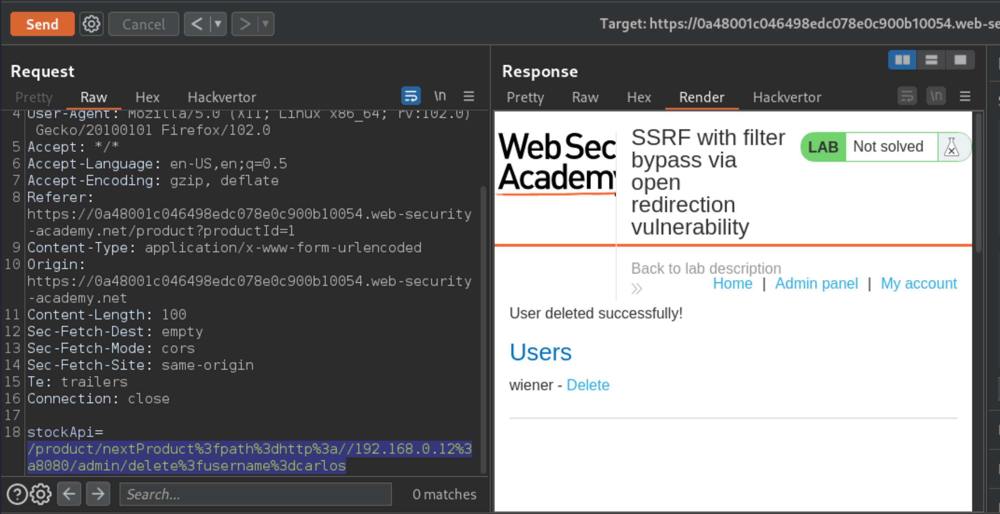

# SSRF with filter bypass via open redirection vulnerability

## Description

[This lab](https://portswigger.net/web-security/ssrf/lab-ssrf-filter-bypass-via-open-redirection) has a stock check feature which fetches data from an internal system.

## Reproduction and proof of concept

1. Visit a product, click **Check stock**, intercept the request in Burp Suite, and send it to Burp Repeater. Click **next product** (on the site) and send that to Repeater also.
2. Try tampering with the ``stockApi`` parameter of the first intercepted request and observe that it isn't possible to make the server issue the request directly to a different host.
3. For the **next product** request observe that the ``path`` parameter is placed into the `Location` header of a redirection response, resulting in an [open redirection](../xss/redirects.md).
4. Create a URL that exploits the open redirection vulnerability, and redirects to the `admin` interface, and feed this into the ``stockApi`` parameter on the stock checker:

5. Observe that the stock checker follows the redirection and shows you the admin page.
6. Amend the path to delete the target user:

## Exploitability

An attacker will need to change the stock check URL to access the admin interface at `http://192.168.0.12:8080/admin` and delete the user `carlos`. The stock checker has been restricted to only access the local application, so the attacker will need to find an open redirect affecting the application first. 
