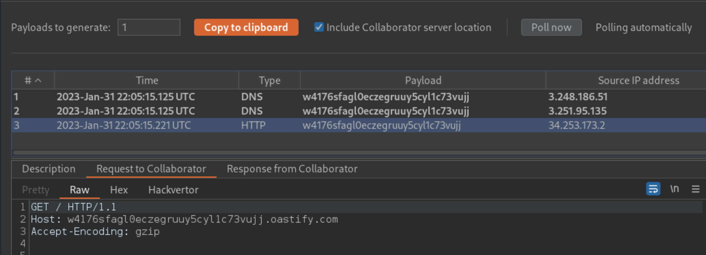

# Blind SSRF with out-of-band detection

## Description

[This site](https://portswigger.net/web-security/ssrf/blind/lab-out-of-band-detection) uses analytics software which fetches the URL specified in the Referer header when a product page is loaded.

## Reproduction and proof of concept

1. In Burp Suite Professional, go to the Burp menu and launch the Burp Collaborator client.
2. Click "Copy to clipboard" to copy a unique Burp Collaborator payload to your clipboard. Leave the Burp Collaborator client window open.
3. Visit a product, intercept the request in Burp Suite, and send it to Burp Repeater.
4. Change the Referer header value to use the generated Burp Collaborator domain in place of the original domain. Send the request.
5. Go back to the Burp Collaborator client window, and click "Poll now". If you don't see any interactions listed, wait a few seconds and try again, since the server-side command is executed asynchronously.
6. You should see some DNS and HTTP interactions that were initiated by the application as the result of your payload.

## Exploitability

An attacker will need to use the analytics functionality to cause an HTTP request to the public Burp Collaborator server. _Note: To prevent the Academy platform being used to attack third parties, the firewall blocks interactions between the labs and arbitrary external systems. To solve the lab, an attacker must use Burp Collaborator's default public server._
