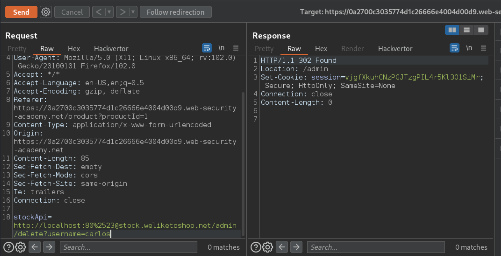

# SSRF with whitelist-based input filter

## Description

[This lab](https://portswigger.net/web-security/ssrf/lab-ssrf-with-whitelist-filter) has a stock check feature which fetches data from an internal system.

## Reproduction and proof of concept

1. Visit a product, click **Check stock**, intercept the request in Burp Suite, and send it to Burp Repeater.
2. Change the URL in the `stockApi` parameter to `http://127.0.0.1/` and observe that the application is parsing the URL, extracting the hostname, and validating it against a whitelist.
3. Change the URL to `http://username@stock.weliketoshop.net/` and observe that this is accepted, indicating that the URL parser supports embedded credentials.
4. Append a `#` to the username and observe that the URL is now rejected.
5. Double-URL encode the `#` to `%2523` and observe the extremely suspicious "Internal Server Error" response, indicating that the server may have attempted to connect to `username`.
6. To access the admin interface and delete the target user, change the URL to:

## Exploitability

An attacker will need to change the stock check URL to access the admin interface at `http://localhost/admin` and delete the user `carlos`. The developer has deployed an anti-SSRF defense the attacker will need to bypass. 
