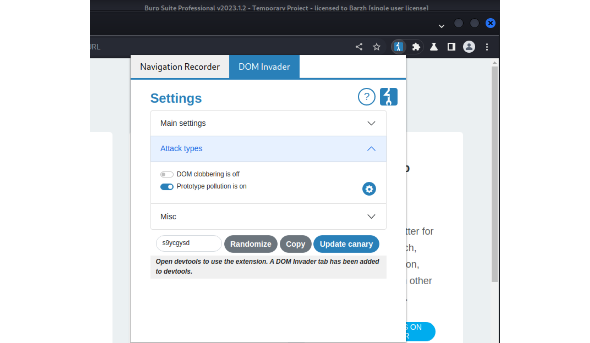
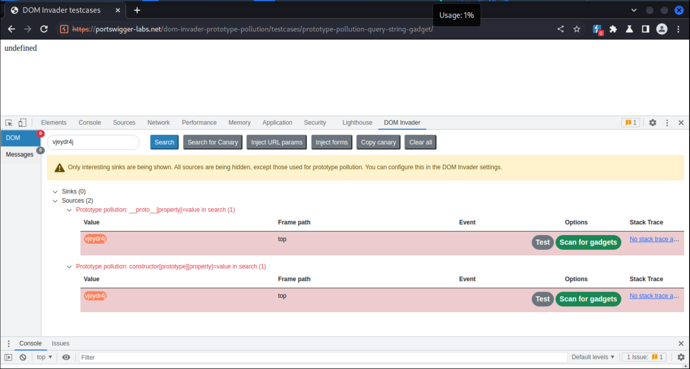
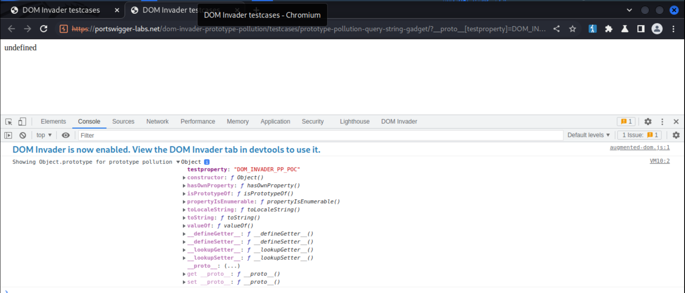
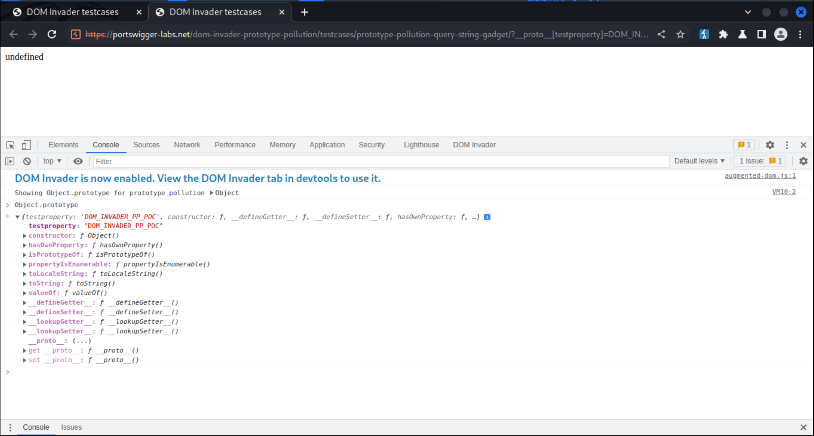
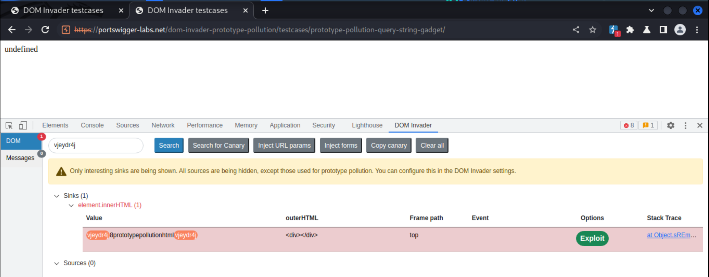

# Prototype pollution

Prototype Pollution occurs when an attacker manipulates `__proto__` (See [ECMAScript® 2015 Language Specification](https://262.ecma-international.org/6.0/#sec-additional-built-in-properties)), usually by adding a new Prototype onto `__proto__`. Since `__proto__`  exists for every `Object`, and every `Objects` inherits the `Prototypes` from their `Prototype`, this addition is inherited by all the JavaScript Objects through the prototype chain. Detecting these vulnerabilities requires reading and understanding a lot of JavaScript code, which can be time-consuming.

Malicious players can take advantage of the ability to insert properties into existing JavaScript code, and execute either Denial of Service attacks, by triggering JavaScript exceptions, or Remote Code Execution, by injecting malicious code. In short, it is an injection attack that targets JavaScript runtimes. 

JavaScript can run on the client-side and server-side of a web application, and prototype pollution vulnerabilities can exist on both sides. 

## Steps

For client-side prototype pollution (CSPP):

* Find prototype pollution sources
* Testing a prototype pollution sources/Try to modify the prototype
* Find possible prototype pollution gadgets

## Prototype pollution sources

Prototype pollution is a vulnerability that occurs when merging an object with a user controlled JSON object. It can also occur as a result of an object generated from query/hash parameters, when the merge operation does not sanitise the keys. This makes it possible to use property keys like `__proto__` , by which arbitrary assignments to the `Object.prototype` (or other global prototypes) can be created. When this happens, it is referred to as a prototype pollution source.

## Detecting CSPP with DOM Invader

[DOM Invader](https://portswigger.net/burp/documentation/desktop/tools/dom-invader) is a browser-based tool that helps test for DOM XSS vulnerabilities using a variety of sources and sinks, including both web message and prototype pollution vectors. It is available via Burp's built-in browser, where it comes preinstalled as an extension. When enabled (if the BurpSuite icon is not visible, **pin it under the jigsaw first**), DOM Invader adds a new tab to the browser's DevTools panel. To use it for finding CSPP (client-side prototype pollution), turn it on in the DOM Invader settings.

And try some [DOMInvader prototype pollution test cases](https://portswigger-labs.net/dom-invader-prototype-pollution/) like [prototype-pollution-query-string-gadget](https://portswigger-labs.net/dom-invader-prototype-pollution/testcases/prototype-pollution-query-string-gadget) to check it works: [See this Portswigger vid](https://www.youtube.com/watch?v=GeqVMOUugqY) for the entire explanation.

To confirm the vulnerability, click on **Test** and in the new tab that appears **Inspect element -> DOM Invader** to view **Object**:

Type `Object.prototype` and enter:

To find gadgets, click on **Scan for Gadgets** and in the new tab that appears **Inspect element -> DOM Invader**

In this example, DOM Invader has discovered a gadget called "html", which ends up in an `innerHTML` sink. A green "Exploit" button has appeared, combining the source discovered with the gadget and automatically creating a prototype pollution exploit. 

## Escalation

Impact varies, depending on the application logic and implementation, and includes DoS, and interfering with the JavaScript environment.

It is also a starting point for further attacks: A prototype pollution attack allows for leveraging gadgets loaded in the same context. These can potentially be used for escalating privileges or gaining access to sensitive information.

* Client-side exploitation of a prototype pollution (CSPP) vulnerability can result in several attacks, such as [cross-site scripting (XSS)](xss.md) attacks. In this case, threat actors look for a gadget that relies on the property of an object susceptible to pollution. If the object interacts with the page’s [document object model (DOM)](../dom/README.md), threat actors can trigger client-side JavaScript code execution.
* Server-side exploitation (SSPP) can lead to more severe consequences, including [remote code execution (RCE)](rce.md), [SQL injection (SQLi)](sqli.md), and [authorisation](acl.md) and [authentication](auth.md) bypasses.

## Portswigger labs

* [DOM XSS via client-side prototype pollution](../pollution/1.md)
* [DOM XSS via an alternative prototype pollution vector](../pollution/2.md)
* [Client-side prototype pollution via flawed sanitization](../pollution/3.md)
* [Client-side prototype pollution in third-party libraries](../pollution/4.md)
* [Client-side prototype pollution via browser APIs](../pollution/5.md)
* [Privilege escalation via server-side prototype pollution](../pollution/6.md)
* [Detecting server-side prototype pollution without polluted property reflection](../pollution/7.md)
* [Bypassing flawed input filters for server-side prototype pollution](../pollution/8.md)
* [Remote code execution via server-side prototype pollution](../pollution/9.md)
* [Exfiltrating sensitive data via server-side prototype pollution](../pollution/10.md)

## Remediation

* `Object.freeze` will mitigate almost all cases. It blocks all changes to an object’s attributes. A prototype is an object which can be frozen like any regular object. `Invoke the Object.freeze(Object.prototype)` element to freeze the default prototype and prevent it from being polluted. The [nopp npm package](https://www.npmjs.com/package/nopp) freezes all common object prototypes automatically.
* Using schema validation to ensure that the JSON data contains the expected attributes. This will remove `__proto__` if it appears in the JSON. 
* Use `Map` primitive (See [ECMAScript® 2015 Language Specification](https://262.ecma-international.org/6.0/#sec-additional-built-in-properties)).
* Use the `Object.create()` method instead of the object constructor `Object()` or the object-literal `{}` when creating a new object. This allows for setting the created object’s prototype directly using the first argument passed to the `Object.create()` element. Objects created using the `Object.create(null)` function will not have the `__proto__` attribute. 
* In general, pay attention when merging two objects recursively, recursively nesting properties, deep cloning of objects, and creating objects by recursively zipping properties with values. These are more prone to Prototype Pollution vulnerabilities than other functions. Whenever a library recursively sets a nested property, it must sanitise the untrusted inputs. Use **safe** open source libraries when recursively setting object's properties.

## Resources

* [HoLyVieR/prototype-pollution-nsec18](https://github.com/HoLyVieR/prototype-pollution-nsec18)
* [Prototype pollution – and bypassing client-side HTML sanitizers](https://research.securitum.com/prototype-pollution-and-bypassing-client-side-html-sanitizers/)
* [BlackFan/client-side-prototype-pollution](https://github.com/BlackFan/client-side-prototype-pollution)
* [Portswigger: What is prototype pollution?](https://portswigger.net/web-security/prototype-pollution)
* [Finding client-side prototype pollution with DOM Invader](https://portswigger.net/blog/finding-client-side-prototype-pollution-with-dom-invader)
* [Daily Swig:Prototype pollution: The dangerous and underrated vulnerability impacting JavaScript applications](https://portswigger.net/daily-swig/prototype-pollution-the-dangerous-and-underrated-vulnerability-impacting-javascript-applications), August 2020
* [Portswigger Research articles: Server-side prototype pollution: Black-box detection without the DoS](https://portswigger.net/research/server-side-prototype-pollution), February, 2023

