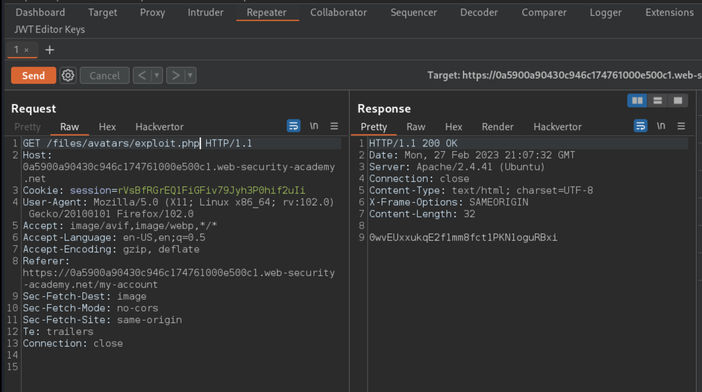

# Remote code execution via web shell upload

## Description

[This lab](https://portswigger.net/web-security/file-upload/lab-file-upload-remote-code-execution-via-web-shell-upload) contains a vulnerable image upload function. It doesn't perform any validation on the files users upload before storing them on the server's filesystem. 

## Reproduction and proof of concept

1. While proxying traffic through Burp, log in to your account and notice the option for uploading an avatar image.
2. Upload an arbitrary image, then return to your account page. Notice that a preview of your avatar is now displayed on the page.
3. In Burp, go to **Proxy -> HTTP history**. Click the filter bar to open the Filter settings dialog. Under Filter by `MIME` type, enable the `Images` checkbox, then apply your changes.
4. In the proxy history, notice that your image was fetched using a `GET` request to `/files/avatars/<YOUR-IMAGE>`. Send this request to Burp Repeater.
5. On your system, create a file called `exploit.php`, containing a script for fetching the contents of Carlos's secret file. For example:

```text
<?php echo file_get_contents('/home/carlos/secret'); ?>
```

6. Use the avatar upload function to upload your malicious PHP file. The message in the response confirms that this was uploaded successfully.
7. In Burp Repeater, change the path of the request to point to your PHP file:

```text
GET /files/avatars/exploit.php HTTP/1.1
```

8. Send the request. Notice that the server has executed your script and returned its output (Carlos's secret) in the response.



9. Enter the secret to solve the lab.

## Exploitability

An attacker will need to log in to `wiener:peter`; upload a basic PHP web shell and use it to exfiltrate the contents of the file `/home/carlos/secret`; and then enter this secret using the button provided in the lab banner. 
