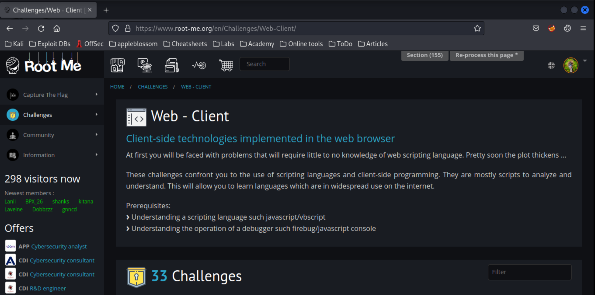

# Introduction

## What?

## Why?

The fast, easy, and **very** affordable way to test hacking skills.

## How?

* [HTML: disabled buttons](disabled-buttons.md)
* [Javascript: authentication](js-authentication.md)
* [Javascript: source](js-source.md)