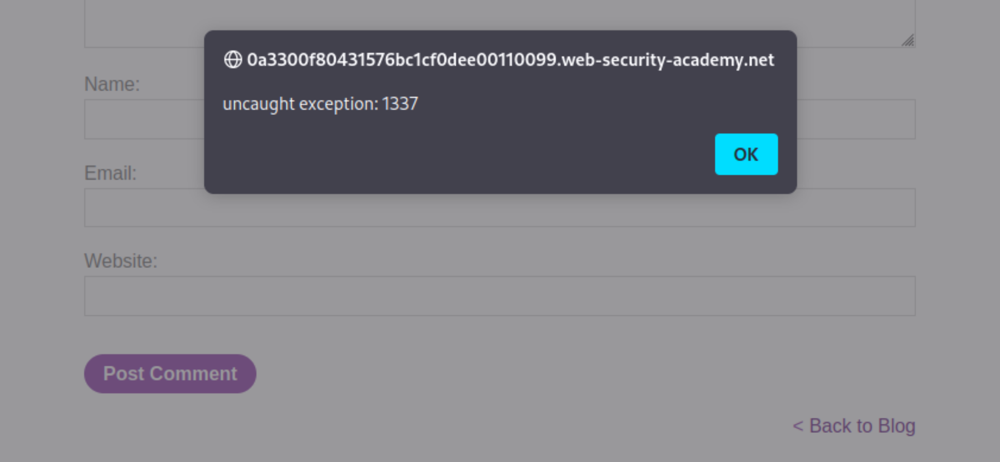

# Reflected XSS in a JavaScript URL with some characters blocked

## Description

The website in [this lab](https://portswigger.net/web-security/cross-site-scripting/contexts/lab-javascript-url-some-characters-blocked) reflects the input in a JavaScript URL, but all is not as it seems. This initially seems like a trivial challenge, but the application is blocking some characters in an attempt to prevent XSS attacks. 

## Reproduction and proof of concept

1. Visit the following URL, replacing `0a3300f80431576bc1cf0dee00110099` with your lab ID:

```text
https://0a3300f80431576bc1cf0dee00110099.web-security-academy.net/post?postId=5&%27},x=x=%3E{throw/**/onerror=alert,1337},toString=x,window%2b%27%27,{x:%27
```

2. Click "Back to blog" at the bottom of the page.



The exploit uses exception handling to call the alert function with arguments. The `throw` statement is used, separated with a blank comment in order to get round the no spaces restriction. The `alert` function is assigned to the `onerror` exception handler.

As `throw` is a statement, it cannot be used as an expression. Instead, we need to use arrow functions to create a block so that the throw statement can be used. We then need to call this function, so we assign it to the `toString` property of `window` and trigger this by forcing a string conversion on `window`.
