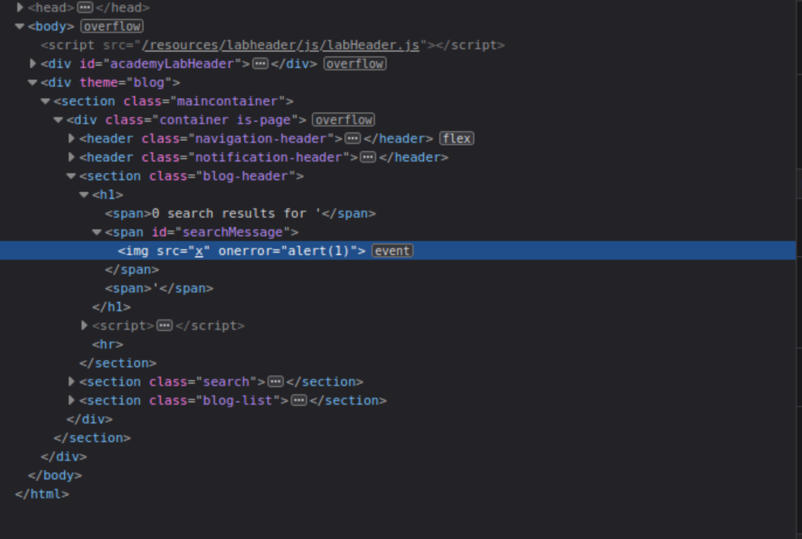

# DOM XSS in innerHTML sink using source location.search

## Description

The website in [this lab](https://portswigger.net/web-security/cross-site-scripting/dom-based/lab-innerhtml-sink) contains a DOM-based cross-site scripting vulnerability in the search blog functionality. It uses an innerHTML assignment, which changes the HTML contents of a div element, using data from `location.search`.

## Reproduction and proof of concept

1. If there is a query in the `location.search` variable (the URL input), `document.getElementById` gets the element with ID `searchMessage`. Then it will set its `innerHTML` to the query. Enter into the search box: 

```text

```



During the rendering of the page, the image fails to load. This will raise the JavaScript `alert`  box, confirming the XSS vulnerability.
