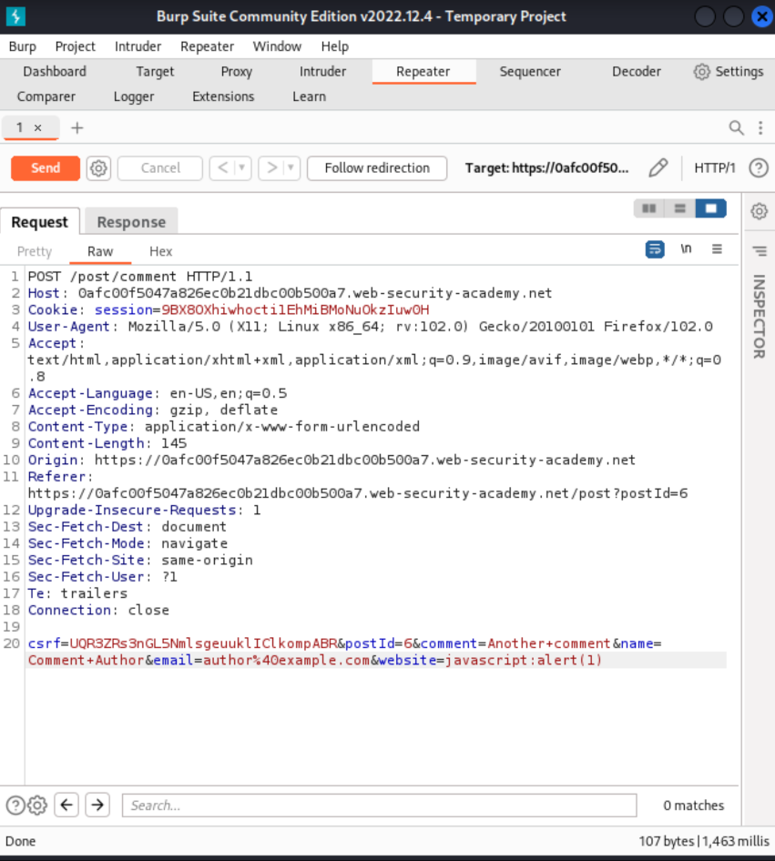

# Stored XSS into anchor href attribute with double quotes HTML-encoded

## Description

The website in [this lab](https://portswigger.net/web-security/cross-site-scripting/contexts/lab-href-attribute-double-quotes-html-encoded) contains a stored cross-site scripting vulnerability in the comment functionality.

## Reproduction and proof of concept

1. Post a comment with a random alphanumeric string in the "Website" input, then use Burp Suite to intercept the request and send it to Burp Repeater.
2. Make a second request in the browser to view the post and use Burp Suite to intercept the request and send it to Burp Repeater.
3. The random string in the second Repeater tab has been reflected inside an anchor `href` attribute.
4. Repeat the process again, replacing the input with a payload to inject a JavaScript URL that calls alert:

```text
javascript:alert(1)
```


    
5. Verify the technique worked by right-clicking, selecting **Copy URL**, and pasting the URL in the browser. Clicking the name above the comment should now trigger an alert.
