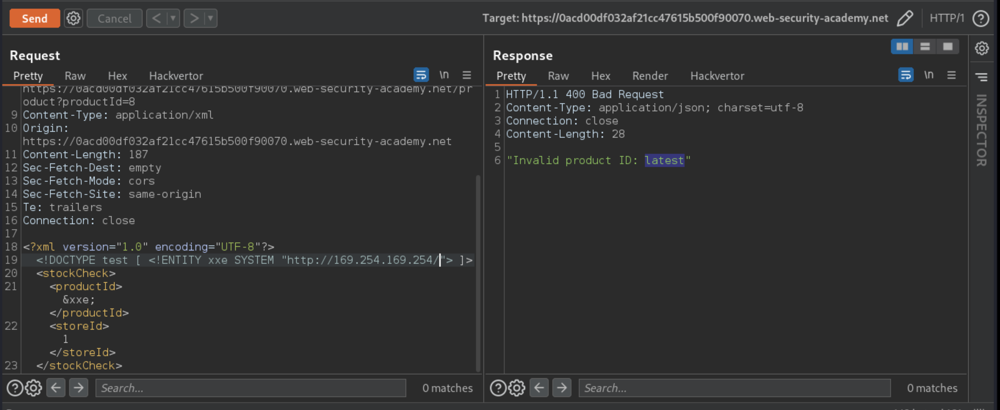
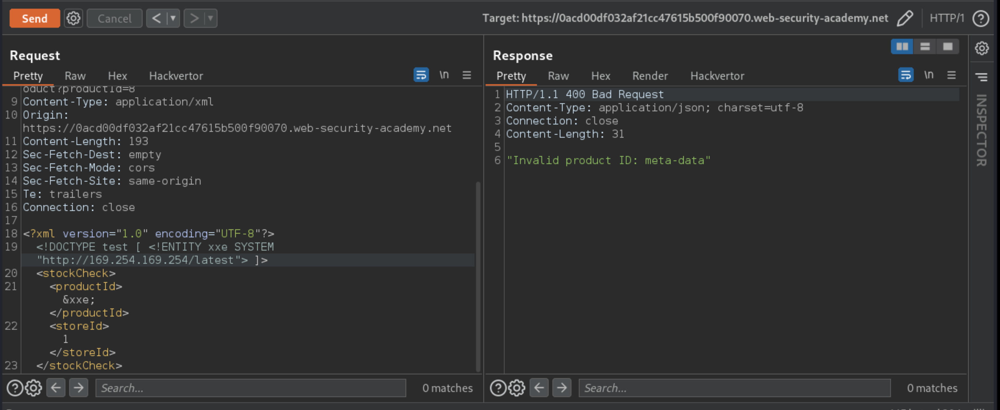
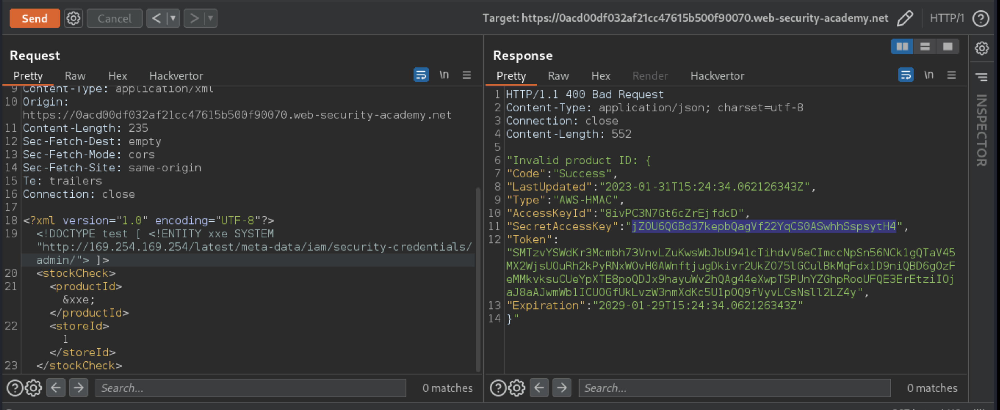

# Exploiting XXE to perform SSRF attacks

## Description

[This lab](https://portswigger.net/web-security/xxe/lab-exploiting-xxe-to-perform-ssrf) has a "Check stock" feature that parses XML input and returns any unexpected values in the response.

The lab server is running a (simulated) EC2 metadata endpoint at the default URL, which is `http://169.254.169.254/`. This endpoint can be used to retrieve data about the instance, some of which might be sensitive.

## Reproduction and proof of concept

1. Visit a product page, click "Check stock", and intercept the resulting POST request in Burp Suite.
2. Insert the following external entity definition in between the XML declaration and the ``stockCheck`` element:

```text
<!DOCTYPE test [ <!ENTITY xxe SYSTEM "http://169.254.169.254/"> ]>
```

3. Replace the ``productId`` number with a reference to the external entity: ``&xxe;``. The response should contain "Invalid product ID:" followed by the response from the metadata endpoint, which will initially be a folder name.



4. Iteratively update the URL in the DTD to explore the API until you reach ``/latest/meta-data/iam/security-credentials/admin``. This should return JSON containing the ``SecretAccessKey``.



...



## Exploitability

An attacker needs to exploit the XXE vulnerability to perform an SSRF attack that obtains the server's IAM secret access key from the EC2 metadata endpoint.
