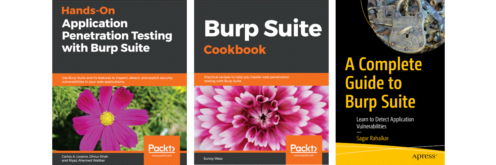

A canopy of apple-blossom
===================================================

TL/DR: Many web applications can still easily be exploited to gain unauthorized access to sensitive data and web
servers. Threats include SQL Injection, Code Injection, XSS, and Cookie poisoning.

And if not for that and shared hosting is used, there may be access via a vulnerable neighbour. Or maybe the server
itself is vulnerable (unlikely, but one never knows).

----

----

.. toctree::
   :maxdepth: 1
   :includehidden:
   :caption: Weaponisation

   docs/prep/README.md
   Build a virtual local testlab <https://red.tymyrddin.dev/projects/iac/en/latest/docs/lab/README.html>
   docs/prep/proxies.md
   docs/prep/automate.md
   docs/prep/recognise.md
   docs/prep/extensions.md
   docs/prep/recon-scripts.md

.. toctree::
   :glob:
   :maxdepth: 1
   :includehidden:
   :caption: Reconnaissance

   docs/recon/README.md
   docs/recon/stroll.md
   Advanced searching <https://red.tymyrddin.dev/projects/recon/en/latest/docs/osint/searching.html>
   Google dorking <https://red.tymyrddin.dev/projects/recon/en/latest/docs/osint/google-dorking.html>
   docs/recon/dns.md
   docs/recon/sneaky.md
   docs/recon/techstack.md

.. toctree::
   :glob:
   :maxdepth: 1
   :includehidden:
   :caption: Enumeration

   docs/enum/README.md
   docs/enum/scanning.md
   docs/enum/binaries.md

.. toctree::
   :glob:
   :maxdepth: 1
   :includehidden:
   :caption: Detection and exploitation

   docs/exploit/README.md
   docs/exploit/xss.md
   docs/exploit/redirects.md
   docs/exploit/clickjacking.md
   docs/exploit/csrf.md
   docs/exploit/idor.md
   docs/exploit/sql.md
   docs/exploit/race.md
   docs/exploit/ssrf.md
   docs/exploit/id.md
   docs/exploit/xxe.md
   docs/exploit/ssti.md
   docs/exploit/access.md
   docs/exploit/rce.md
   docs/exploit/sop.md
   docs/exploit/sso.md
   docs/exploit/disclosure.md

.. toctree::
   :maxdepth: 1
   :includehidden:
   :caption: Portswigger labs

   docs/pal/README.md
   docs/pal/xss.md
   docs/pal/sqli.md
   docs/pal/csrf.md
   docs/pal/clickjacking.md
   docs/pal/dom.md
   docs/pal/cors.md
   docs/pal/xxe.md
   docs/pal/ssrf.md
   docs/pal/smuggling.md
   docs/pal/os.md
   docs/pal/ssti.md
   docs/pal/traversal.md
   docs/pal/access.md
   docs/pal/auth.md
   docs/pal/sockets.md
   docs/pal/cache.md
   docs/pal/id.md
   docs/pal/disclosure.md
   docs/pal/business.md
   docs/pal/headers.md
   docs/pal/oauth.md
   docs/pal/file-upload.md
   docs/pal/jwt.md
   docs/pal/essential.md
   docs/pal/pollution.md

.. toctree::
   :maxdepth: 1
   :includehidden:
   :caption: Capture The Flag

   docs/ctf/README.md
   docs/ctf/picklerick.md

.. toctree::
   :caption: Links

   Red Team <https://red.tymyrddin.dev/>
